<p align="center">
  
</p>

<br>

<h3 align="center">rinn · @rvnka</h3>

<p align="center">
<b>he/him</b><br>
student & beginner dev<br>
building things out of curiosity, interest, and the fun of seeing ideas become real.
</p>

<br>

```
os      android, linux
device  Xiaomi 23122PCD1G
        Xiaomi M2101K7AG
stack   shell, html/css, js, ts, node, python
into    open-source, manga, anime, games
```

> coffee. code. sleep. repeat.

<br>

<p align="center">
<a href="https://youtube.com/@rvnka_yt">
  
</a>
<a href="https://ko-fi.com/ringga">
  
</a>
</p>

<br>

<p align="center">



</p>
<p align="center">
  
</p>

<br>

<p align="center">
  
</p>
